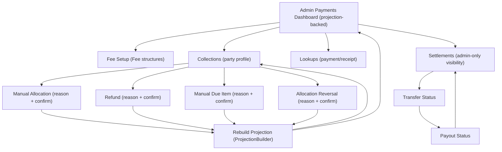
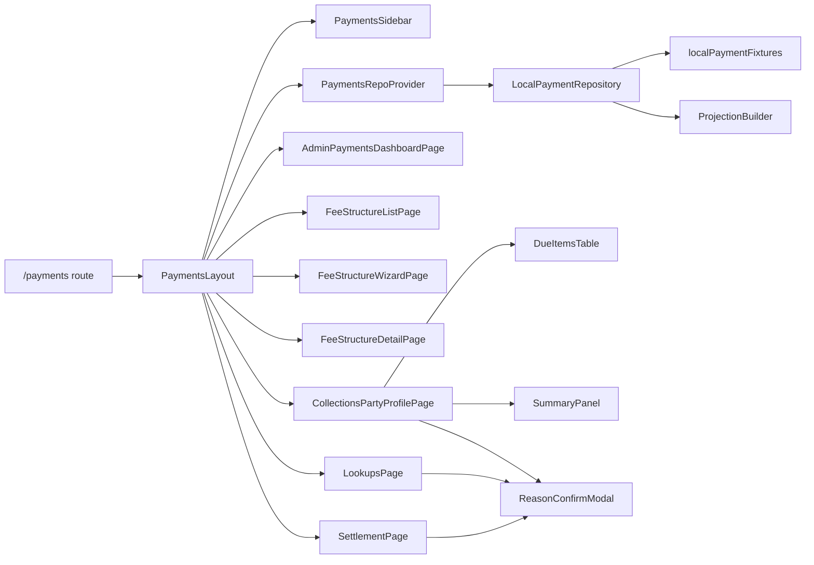

# Payment Module Redesign (Basic v3.1, Local-Only)

## Executive summary
- Implements a new **admin web Payments** module under `src/features/payments/*` that follows **School Stack Payment Execution Spec v3.1** and uses **Payment Module Handoff v3.1** for screen responsibilities.
- The new module is **local-only**: it uses a single in-memory `LocalPaymentRepository` and rebuildable projections via `ProjectionBuilder`. No runtime API/network calls are used by these screens.
- The admin Payments Dashboard is intentionally **narrow**: it displays only projection-derived summary values, PDF-defined status counts, and navigation shortcuts. No charts, reports, trends, exports, notifications, or activity feeds.

## Detected stack (from repo)
- React (Vite) + React Router DOM
- TailwindCSS
- Redux Toolkit (existing app state; payments module uses local repository + React context)
- Jest + React Testing Library

## New admin routes
- `/payments/dashboard`
- `/payments/fee-setup` (+ `/payments/fee-setup/new`, `/payments/fee-setup/settings`, `/payments/fee-setup/:feeStructureId`)
- `/payments/collections` (+ `/payments/collections/:partyId`)
- `/payments/lookups`
- `/payments/settlements`

## Mermaid diagrams

### User flow (admin + local canonical flow)

### Component relationships (new module)

## Old UI vs new UI comparison
| Area | Old behavior | New behavior | PDF rationale | Assumptions |
|---|---|---|---|---|
| Admin Payments navigation | Old payments route was commented out; legacy module exists under `src/components/payments/*`. | New deep-linkable routes under `/payments/*` with sidebar tabs. | PDFs define clear module boundaries and screen responsibilities; deep links help QA. | Legacy module remains in repo but is not linked. |
| Dashboard | Legacy module includes report-like UI (charts/visuals) and live API dependencies in payments-related code. | Dashboard shows only: projection-derived summary values + PDF enum status counts + shortcuts. No charts/analytics/feeds. | PDFs forbid frontend-derived financial truth and position Basic v1 as collection/receipt/allocation, not analytics. | "Recent payments feed" is omitted intentionally. |
| Fee setup | Legacy fee setup depends on backend endpoints (axiosClient + EndPoints). | Fee setup is legacy-parity UX (Fee Structures list + create flow) but **local-only**, with **Due Day of Month** and **multiple fee heads per setup** (including in-flow fee head creation). | Basic v1 requires fee structure setup UI; fee setup is config only and must not create payment/receipt/allocation/refund/settlement facts. | Due schedule preview is configuration-only; due item generation remains out of scope. |
| Collections | Legacy reports view calculates totals in UI and fetches via APIs. | Party profile shows projection-backed summary + due items + payments/receipts/allocations/refunds tables. Manual due/allocation/refund/reversal require reason. | Explicit allocation records, rebuildable projections, and controlled admin mutations are required. | Amount formatting is UI formatting only. |
| Lookups | Legacy "transactions" view is API-driven. | Local payment + receipt lookup by id/ref. Refund action available with reason. | PDFs specify payment/receipt lookup and controlled admin actions. | Lookup operates on local canonical records only. |
| Settlement | Legacy UI not separated. | Admin-only settlement screen shows transfer/payout states; retry creates a new attempt record. Never affects paid status. | "Settlement is separate" rule: transfers/payouts must not change student payment truth. | Provider refs are mocked/offline in this local-only redesign. |

## Files (exact)

### Modified
- `jest.setup.js`
- `src/App.jsx`
- `src/components/Navbar.jsx`

### Added (new payments module)
- `src/features/payments/pages/PaymentsLayout.jsx`
- `src/features/payments/pages/AdminPaymentsDashboardPage.jsx`
- `src/features/payments/pages/FeeStructureListPage.jsx`
- `src/features/payments/pages/FeeStructureWizardPage.jsx`
- `src/features/payments/pages/FeeStructureDetailPage.jsx`
- `src/features/payments/pages/FeeSetupSettingsPage.jsx`
- `src/features/payments/pages/CollectionsPartyProfilePage.jsx`
- `src/features/payments/pages/LookupsPage.jsx`
- `src/features/payments/pages/SettlementPage.jsx`
- `src/features/payments/components/PaymentsSidebar.jsx`
- `src/features/payments/components/SummaryPanel.jsx`
- `src/features/payments/components/StatusBadge.jsx`
- `src/features/payments/components/DueItemsTable.jsx`
- `src/features/payments/components/ReasonConfirmModal.jsx`
- `src/features/payments/components/ReceiptDrawer.jsx`
- `src/features/payments/components/EmptyState.jsx`
- `src/features/payments/hooks/usePaymentsRepo.js`
- `src/features/payments/hooks/usePaymentsDashboard.js`
- `src/features/payments/hooks/usePartyProfile.js`
- `src/features/payments/store/PaymentsRepoProvider.jsx`
- `src/features/payments/services/localPaymentFixtures.js`
- `src/features/payments/services/ProjectionBuilder.js`
- `src/features/payments/services/LocalPaymentRepository.js`
- `src/features/payments/services/FeeScheduleBuilder.js`
- `src/features/payments/services/paymentsInvariants.js`
- `src/features/payments/utils/formatters.js`
- `src/features/payments/utils/paymentsNav.js`

### Added (tests + docs)
- `src/__tests__/payments/payments.noNetwork.test.jsx`
- `src/__tests__/payments/payments.invariants.test.js`
- `src/__tests__/payments/payments.dashboardScope.test.jsx`
- `src/__tests__/payments/feeSetup.dueDay.test.jsx`
- `src/__tests__/payments/feeSetup.sections.test.jsx`
- `src/__tests__/payments/feeSetup.feeHeads.test.jsx`
- `src/__tests__/payments/feeSetup.noArtifacts.test.js`
- `src/docs/payments/PaymentRedesign.md`

## User-visible error strings (explicit)

### Modal validation
- "Reason is required"

### Generic action failures (UI fallbacks)
- "Failed to create due item."
- "Failed to allocate."
- "Failed to refund."
- "Failed to reverse allocation."
- "Refund failed."
- "Retry failed."
- "Failed to save settings."
- "Failed to create fee head."
- "Please complete required fields."
- "Payment not found."
- "Receipt not found."

### Fee setup validation strings
- "Due Day of Month must be between 1 and 31."
- "Fee head name is required."
- "Select at least one section."
- "Select at least one fee head."
- "Amounts must be provided for all active periods."
- "Invalid frequency."
- "Invalid effective date."
- "Invalid late fee value."

### Domain invariant errors (from LocalPaymentRepository / paymentsInvariants)
- "Reason is required."
- "Party not found."
- "Manual allocation is disabled."
- "Due item not found."
- "Payment not found."
- "Payment is not succeeded."
- "Invalid allocation amount."
- "Allocation exceeds due outstanding."
- "Allocation exceeds unallocated payment amount."
- "Allocation not found."
- "Allocation is not active."
- "Invalid refund amount."
- "Refund exceeds refundable amount."
- "Transfer not found."
- "Only failed transfers can be retried."
- "Invalid input."
- "Receipt cannot exist for failed payment."
- "Structure name is required."
- "Fee structure not found."
- "Only drafts can be edited."
- "Only drafts can be activated."
- "Invalid amount."
- "Invalid <field>."

## Explicit assumptions
- Parent mobile UI is deferred because this repo contains only the admin web app.
- State is in-memory per session; refresh resets mock data.
- Fee schedule preview is mocked; real due generation is explicitly out of scope.
- Payment module handoff PDF text extraction is not guaranteed; visual polish uses repo design tokens and conservative layout choices.
- User-visible error strings are minimal and neutral (listed above).

## Build/run
- `yarn dev`
- `yarn test`
- `yarn build`
